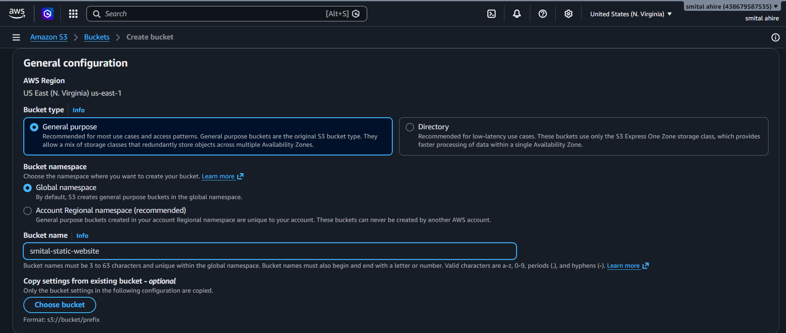
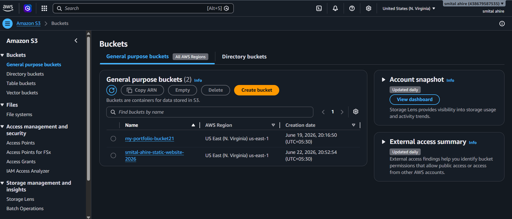
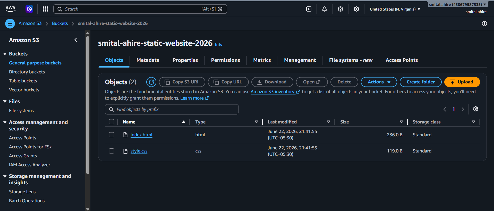
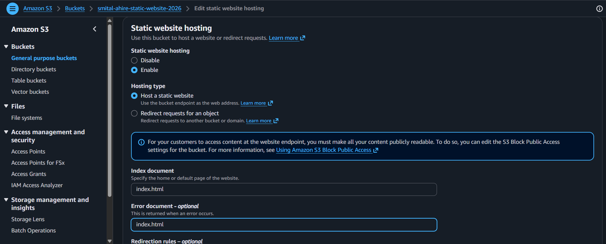
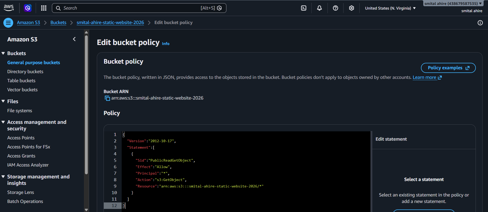

# AWS Static Website Hosting on Amazon S3

## Project Overview

This project demonstrates how to host a static website using Amazon S3. The website consists of HTML and CSS files and is publicly accessible through the S3 Static Website Hosting feature.

## Services Used

* Amazon S3
* AWS Management Console

## Project Architecture

User → Amazon S3 Bucket → Static Website Hosting → Website Content

## Steps Performed

### Step 1: Create an S3 Bucket

* Logged in to AWS Management Console.
* Opened Amazon S3 service.
* Created a new bucket with a unique name.

### Step 2: Upload Website Files

* Uploaded:

  * index.html
  * style.css

### Step 3: Enable Static Website Hosting

* Opened bucket Properties.
* Enabled Static Website Hosting.
* Set index document as:

  * index.html

### Step 4: Configure Permissions

* Disabled Block Public Access.
* Added a bucket policy to allow public read access.

### Step 5: Access Website

* Used the S3 Website Endpoint URL.
* Verified that the website is accessible from the browser.

## Screenshots

The repository contains screenshots showing each step of the implementation:

### S3 Bucket Created

### Files Uploaded

### Static Website Hosting Enabled

### Bucket Policy Added

### Website Endpoint Generated

### Public Access Configuration

### Live Website

## Learning Outcomes

Through this project, I learned:

* Amazon S3 bucket creation
* Static website hosting on AWS
* Public access configuration
* Bucket policy management
* Website deployment using AWS services

## Author

Smital Rajendra Ahire

## Conclusion

Amazon S3 provides a simple and cost-effective solution for hosting static websites without managing servers.
